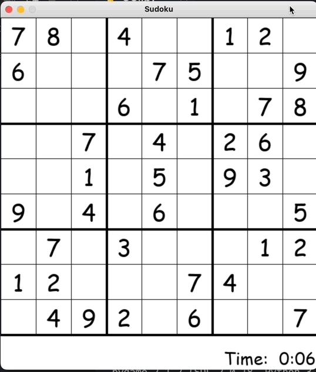

# Sudoku-GUI-Solver
This is a sudoku solver using the backtracking algorithm. It employs a graphical GUI as well as a text based version.

Run GUI.py to play sudoku.

```
python GUI.py
```

# Instructions
Click a box and hit the number on your keybaord to pencil in a number. To confirm that value press the ENTER key on that box. To delete a pencil in you can click DEL. If you put the wrong number in 3 times the algorithum will start to run and the board will solve itsself. If you want to see the board gt solved, click on the spacebar to see the algorithum run.


